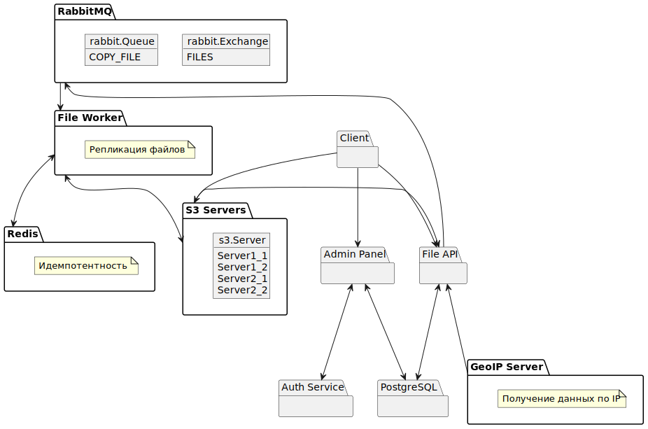

# Проектная работа: диплом

Вопрос: непонятно зачем в кинотеатре загрузка файлов пользователями?

## Задание 1

Создать админ-панель, предоставляющую пользователям возможность управления файлами.
1. Авторизацию выполнить через Auth сервис кинотеатра;
1. История действий пользователя. Добавление, обновление, удаление файла;
1. Формирование общедоступной ссылки на файл;
1. Формирование ссылки на чтение/запись для определенных пользователей;
    - Для расшаривания на других пользователей админка должна знать полный список пользователей. Нужно делать ETL для переливания пользователей из Auth сервиса в админку?

1. Время жизни ссылки
    - Установка пароля на ссылку ? S3 не поддерживает, нужно показывать страницу пользователю.

## Задание 2

Поднять несколько S3 совместимых серверов, расположенных географически распределенно.
    - Реально распределенно или можно условно это принять?

## Задание 3

Создать API для загрузки/скачивания файлов.
1. При загрузке определять ближайший сервер S3 и выполнять загрузку на него
    - Как определить ближайший сервер? Вычислить расстояние из координат?
    - Как определить местоположение пользователя? GeoIP ? Платные сервисы и даже БД платные. Можно ли сделать фейковый GeoIP сервис?
    - Если API единое, то по запросу ручка должна выдавать какую-то новую ссылку на один из серверов S3, по которой клиент должен загрузить файл?

1. При загрузке эмитировать событие о том, что новый файл загружен в шину данных.
1. При скачивании определить ближайшие сервера в геогафическом отношении, из них выбрать наименее загруженный и с него отдать файл.
    - Как выбрать наименее загруженный сервер? Фэйковое число соединений?
1. Организовать хранение в БД информации о том, на каких серверах доступен определенный файл.

## Задание 4
Организовать шину и воркер для репликации даннных между серверами.
1. По событию в шине данных воркер должен реплицировать файл на остальные сервера
1. После копирования файла на сервер нужно отправить событие в шину, чтобы воркер поставил отметку в БД, что репликация выполнена.

## Задание 5
Помимо основного кода требуется добавить CI пайплайн в Github Actions, который содержит следующие элементы:
- Проверка кода линтером wemake-python-styleguide;
- Проверка типов методов и переменных через mypy;
- Запуск кода на версиях Python 3.8 и 3.9;
- Отчёт по проверке линтерами в формате HTML-файла;
- Отправка уведомления об успешности или неуспешности прохождения пайплайна в телеграм канал.

## Деплой на Яндекс.Облако
Залить сервис в облако
 - Обязательно ли?

 ## UML

