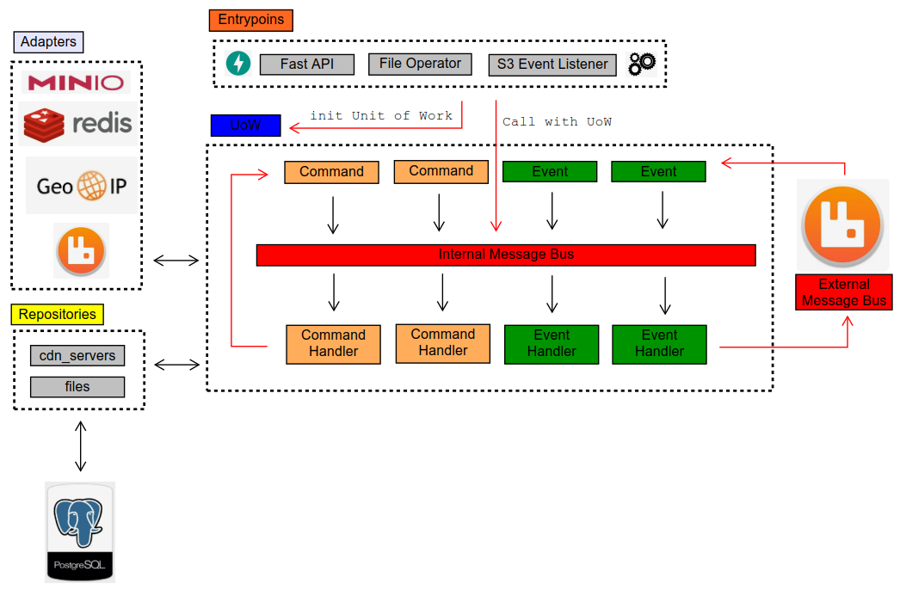
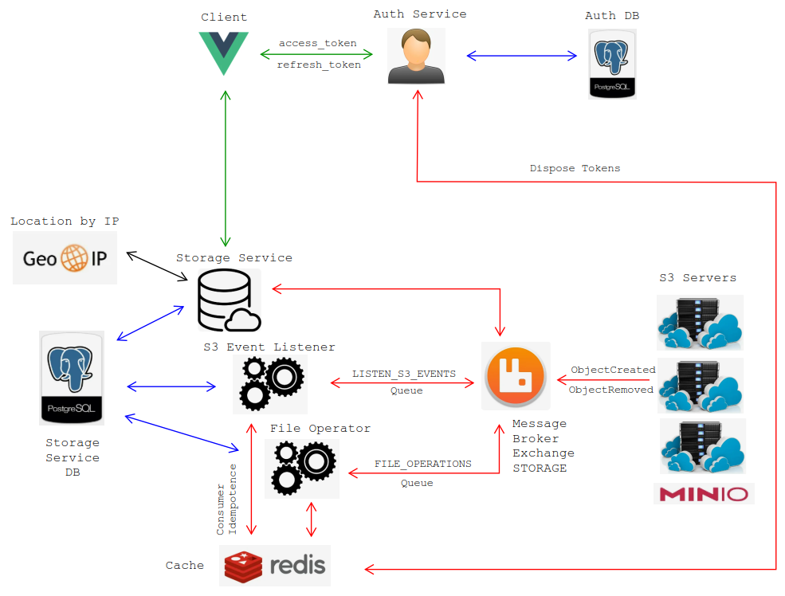

# Распределенное хранение файлов
https://github.com/vokson/graduate_work

## Проект разрабатывал:
  - Носков Алексей

## Deploy
Сервис запущен и работает по адресу http://10.95.27.163/. Пароль везде "qwe12345".

### Пользователи
Доступны 2 пользователя:
- user
- admin (имеет доп. права на добавление, изменение, удаление CDN серверов)

### Базы данных
- БД auth доступна на порту 5451. Имя пользователя "postgres".
- БД storage доступна на порту 5452. Имя пользователя postgres".

### Шина данных RabbitMQ
- Порт 15672. Имя пользователя "admin".

### S3 Minio хранилища данных
- Порт 9091. Имя пользователя "admin".
- Порт 9092. Имя пользователя "admin".
- Порт 9093. Имя пользователя "admin".
- Порт 9094. Имя пользователя "admin".
- Порт 9095. Имя пользователя "admin".

### Open API
- Сервис auth. http://51.250.10.146/users/api/openapi
- Сервис storage. http://51.250.10.146/storage/api/openapi

##  Архитектура отдельного сервиса
Сервис имеет событийно-ориентированную архитектуру, основанную на идеях, изложенных в книге "Architecture Patterns of Python", Harry J.W. Percival, Bob Gregory. https://www.cosmicpython.com/book/preface.html

По возможности везде используется асинхронный Python. ORM не используется.



### Точки входа (Entrypoints)
Приложение имеет несколько точек входа
- Fast API - обработка HTTP запросов
- File Operator - воркер для работы с файлами
- S3 Event Listener - воркер для обработки сообщений, поступающих от CDN серверов

Точка входа инициирует рабочий модуль передавая в качестве параметра информацию об адаптерах, которые нужны ей для работы.

### Рабочий модуль (Unit of Work - Uow)
Класс, который при старте подключает к себе все необходимые адаптеры и репозитории. Работает, как асинхронный контекст менеджер, управляющий в том числе тразакциями БД.

### Шина сообщений (Internal Message Bus)
Является "сердцем" приложения. Класс, который инициализируется точкой входа посредством передачи следующих параметров:
- UoW
- Списки обработчиков сообщений (команд и событий) 

Класс хранит в себе очередь сообщений на обработку и запускает необходимые обработчики. Хранит результаты возвращаемые при обработке сообщений-команд, а также обрабатывает исключения.

Любой обработчик может добавить сообщей в шину в процессе своей работы. Таким образом цикл обработки начальной команда закончится только тогда, когда будут обработаны все порожденные сообщения.

### Внутренние сообщения (Event & Command)
Классы, которые хранят в себе информацию, необходимую для обработчика. Обработчик Command обязан вернуть результат. Обработчик Event результат не возращает.

### Адаптеры (Adapters)
Классы, используемые для обращения к внешним сервисам, шинам, БД и т.д. Хранят в себе соединения или пулы соединений. Используются следующие адаптеры
- db - отвечает за работу с БД
- s3 - отвечает за работу с S3 совместимыми CDN серверами
- geoip - отвечает за получение геоданных по IP
- publisher - отвечает за публикацию сообщений во внешнюю шину RabbitMQ
- consumer - отвечает за получение сообщений из внешней шины RabbitMQ
- cache - отвечает за работу с Redis

### Репозитории (Repositories)
Классы, которые отвечают за работу с БД. Формируют запросы и превращают ответы в модели данных.

### Внешняя шина сообщений (External Message Bus)
Шина сообщений RabbitMQ. Имеет один exchange STORAGE и две очереди LISTEN_S3_EVENTS и FILE_OPERATIONS, используемых соответственно для сообщений от CDN серверов и сообщений от сервиса.

##  Архитектура проекта
В качестве клиента в данном проекте используется фронтенд, написанный на VueJS.



Пользователь авторизуется через сервис Auth и получает access и refresh токены, а также информацию о пользователе. После чего ему, в зависимости от списка разрешений данного пользователя, доступны следующие операции, выполняемые через сервис Storage.

- Получение списка файлов пользователя
- Добавление файла
- Удаление файла
- Переименовывание файла
- Получение истории действий пользователя
- Создание ссылки (возможно запароленной, со сроком действия) для доступа к файлу
- Удаление ссылку доступа к файлу
- Скачивание файла по ссылке
- Добавление CDN сервера
- Изменение параметров CDN сервера
- Удаление CDN сервера

## Краткое описание работы

В качестве хранилищ данных по умолчанию используются 5 серверов Minio, условно расположенных в:
- Зона Africa - Город Cape Town
- Зона Russia - Город Vladivostok
- Зона USA - Город New York
- Зона USA - Город Dallas
- Зона USA - Город Detroit

CDN сервера имеют параметры is_on (Вкл/Выкл) и is_active (Активен или нет). Все операции с файлами происходят только с серверами, отмеченными Вкл.

При добавлении файла он распределяется по всем АКТИВНЫМ серверам зоне того сервера, на который файл был загружен первоначально.

При удалении файлам он удаляется со всем ВКЛ сервером, на которых он был раположен, даже если они НЕ АКТИВНЫ.

### Добавление файла
1. При добавлении файла определяется IP пользователя (в зависимости от настроек приложения может использоваться реальный или фэйковый IP).
1. По IP определяется геолокация и координаты широты и долготы.
1. Выбирается ближайший к пользователю сервер.
1. Сервис Storage обращается к данному S3 серверу и получает подписанную ссылку для загрузки файла.
1. Ссылка возвращаетcя клиенту в ответе API.
1. Клиент загружает файл по ссылке.
1. S3 сервер публикует сообщение в RabbitMQ о том, что файл загружен
1. Воркер s3_event_listener воркер читает данное сообщение и эмитирует сообщение в RabbitMQ о том, что файл размещен на сервере
1. Воркер file_operator читает сообщение из RabbitMQ
1. Определяет есть ли еще активные сервера в зоне размещения файла
1. Если есть, скачивает файл во временное хранилище
1. Загружает файл на оставшиеся сервера
1. Удаляет файл из временного хранилища

### Скачивание файла
1. При добавлении файла определяется IP пользователя (в зависимости от настроек приложения может использоваться реальный или фэйковый IP).
1. По IP определяется геолокация и координаты широты и долготы.
1. Выбирается ближайший к пользователю сервер.
1. Сервис Storage обращается к данному S3 серверу и получает подписанную ссылку для скачивания файла.
1. Ссылка возвращаетcя клиенту в ответе API.

### Удаление файла
1. При удалении файла он помечается в БД как удаленный.
1. В шину данных RabbitMQ отправляется сообщение об удалении файла
1. Воркер file_operator обрабатывает данное сообщение и удаляет файлы со всех серверов, на которых он раположен

### Изменение параметров CDN сервера
Если при обновлении сервера он оказался ВКЛ и АКТИВ, то файлы, раположенные в той же зоне на других серверах подлежат загрузке на данный сервер.

Таким образом, если активировать дополнительный сервер или переместить сервер из одной зоны в другую, он будет обогащен файлами.

Возможно добавлять сервера "на горячую" при выполнении следующих условий:
- Сервер должен быть подключен в шине данных RabbitMQ на порту 5672
- Сервер должен посылать сообщения с ключом S3.ИМЯ.EVENT, где ИМЯ - это имя сервера в БД.

## Демо
Краткое опишу интерфейс пользователя, чтобы было понятно куда нажимать.

## Запуск на новом сервере
1. Клонируйте репозиторий.
1. Создайте файл .env и заполните его. Используйте .env.example в качестве примера.
1. Откройте необходимы порты
1. Установите Docker и Docker Compose
1. Запустите Docker контейнеры
    ```console
    make up
    ```

1. Выполнить миграции
    ```console
    make migrate
    ```

1. Наполните БД первоначальными данными
    ```console
    make pollute
    ```

1. Исправьте IP адреса у CDN серверов

